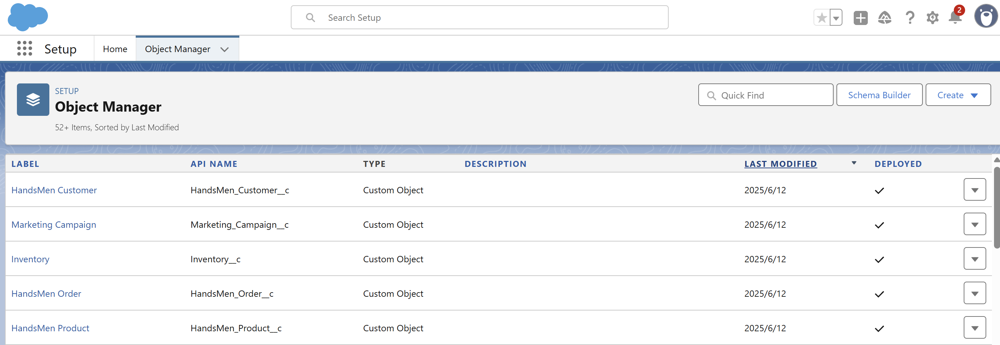

# 1️⃣ HandsMen Customer
sfdx force:object:create --label "HandsMen Customer" --plural "HandsMen Customers" \
  --objectname HandsMen_Customer__c --deploymentstatus Deployed \
  --enablereports true --enablesearch true

# 2️⃣ HandsMen Product
sfdx force:object:create --label "HandsMen Product" --plural "HandsMen Products" \
  --objectname HandsMen_Product__c --deploymentstatus Deployed \
  --enablereports true --enablesearch true

# 3️⃣ HandsMen Order（含 AutoNumber 格式）
sfdx force:object:create --label "HandsMen Order" --plural "HandsMen Orders" \
  --objectname HandsMen_Order__c --deploymentstatus Deployed \
  --enablereports true --enablesearch true --recordname "HandsMen OrderNumber" \
  --recordnametype AutoNumber --autonumberformat "O-{0000}" --startingnumber 1

# 4️⃣ Inventory
sfdx force:object:create --label "Inventory" --plural "Inventories" \
  --objectname Inventory__c --deploymentstatus Deployed \
  --enablereports true --enablesearch true --recordname "Inventory Number" \
  --recordnametype AutoNumber --autonumberformat "I-{0000}" --startingnumber 1

# 5️⃣ Marketing Campaign
sfdx force:object:create --label "Marketing Campaign" --plural "Marketing Campaigns" \
  --objectname Marketing_Campaign__c --deploymentstatus Deployed \
  --enablereports true --enablesearch true --recordname "Marketing Campaign Number" \
  --recordnametype AutoNumber --autonumberformat "MC-{0000}" --startingnumber 1
