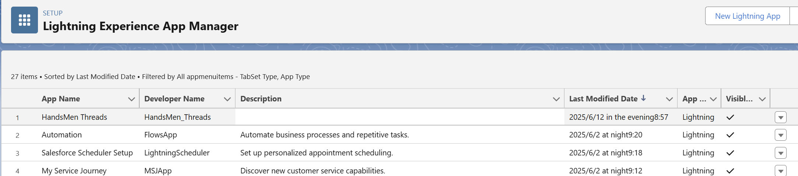
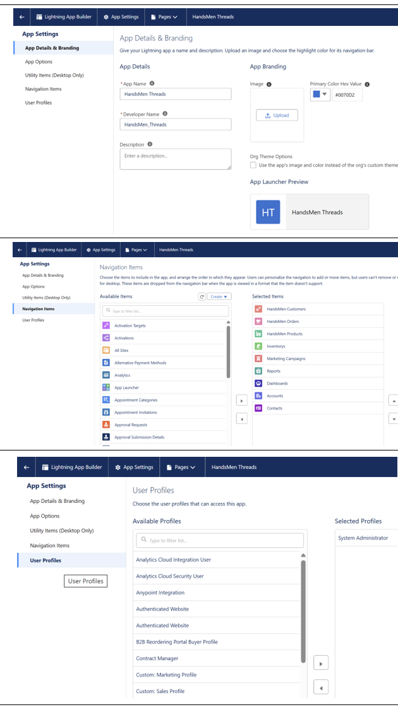

# 06. Create a Lightning App – HandsMen Threads

## 1️⃣ 透過 UI 建立（Lightning App Builder）

1. Setup → **App Manager** → **New Lightning App**  
2. App Details & Branding  
   - App Name：`HandsMen Threads`  
   - Description：CRM + Inventory 管理入口  
   - Logo：`HandsMenLogo.png`（static resource）  
3. App Options / Utility Items 保持預設  
4. Navigation Items：Customer、Order、Inventory、Product、Reports、Dashboards  
5. User Profiles：System Administrator → **Save & Finish**


---

## 2️⃣ 透過 Metadata 部署

> 若要一次發佈到多個 Sandbox / Scratch Org，可使用下列 XML 與 CLI 指令。

### 2-1. `HandsMen_Threads.app-meta.xml`

```xml
<?xml version="1.0" encoding="UTF-8"?>
<CustomApplication xmlns="http://soap.sforce.com/2006/04/metadata">
    <description>HandsMen Threads – Main Lightning App</description>
    <label>HandsMen Threads</label>
    <uiType>Lightning</uiType>
    <navType>Standard</navType>
    <utilityBar>
        <utilityItem>
            <utilityItemName>History</utilityItemName>
            <utilityLabel>History</utilityLabel>
        </utilityItem>
        <utilityItem>
            <utilityItemName>Notes</utilityItemName>
            <utilityLabel>Notes</utilityLabel>
        </utilityItem>
    </utilityBar>
    <logo>HandsMenLogo</logo>
    <tabs>
        <tab>HandsMen_Customer__c</tab>
        <tab>HandsMen_Order__c</tab>
        <tab>Inventory__c</tab>
        <tab>HandsMen_Product__c</tab>
        <tab>standard-Report</tab>
        <tab>standard-Dashboard</tab>
    </tabs>
    <profiles>System Administrator</profiles>
</CustomApplication>
