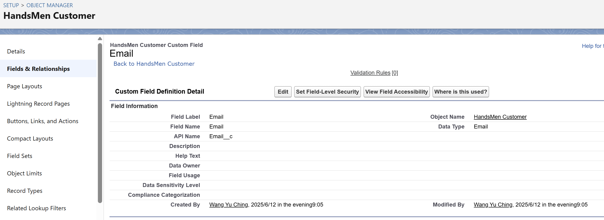
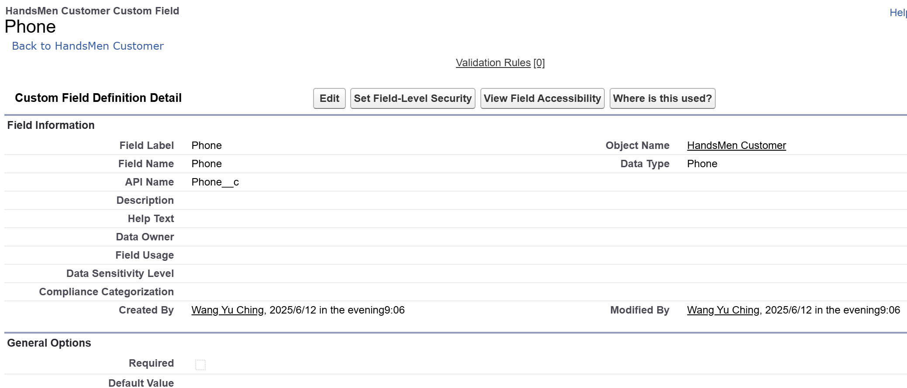
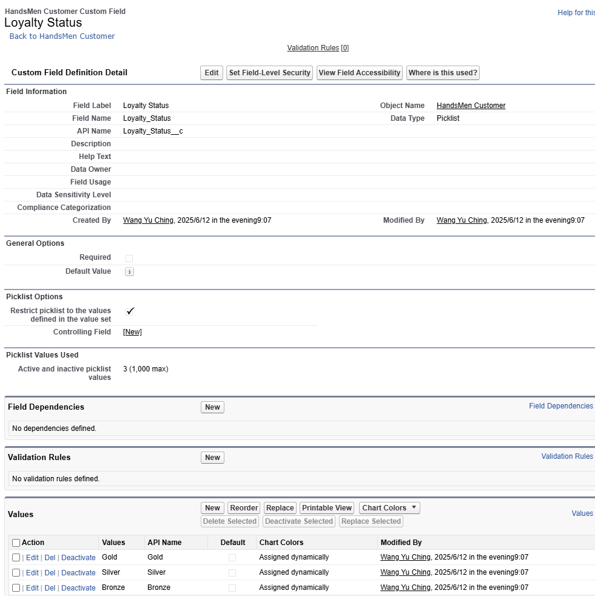

## 1️⃣Creating Field in HandsMen Customer
**Creating Field(Email) in HandsMen Customer** **Object**

*sfdx force:field:create -o HandsMen_Customer__c -l Email -n Email__c -t Email*

**Creating Phone(Phone) on HandsMen Customer Object**

*sfdx force:field:create -o HandsMen_Customer__c -l Phone -n Phone__c -t Phone*

 
**Creating Picklist field(Loyalty Status) on HandsMen Customer object**

*sfdx force:field:create ... -t Picklist -v "Gold;Silver;Bronze"*

**Unit 1 : Creating Lookup Relationship between Marketing Campaign and HandsSome Customer**

**Unit 2 : Creating Lookup Relationship between HandsMen Product and HandsMen Order**

