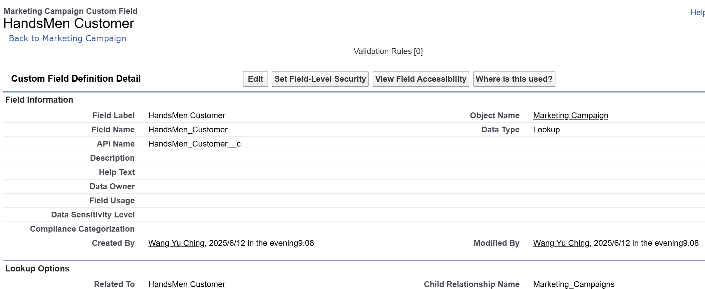
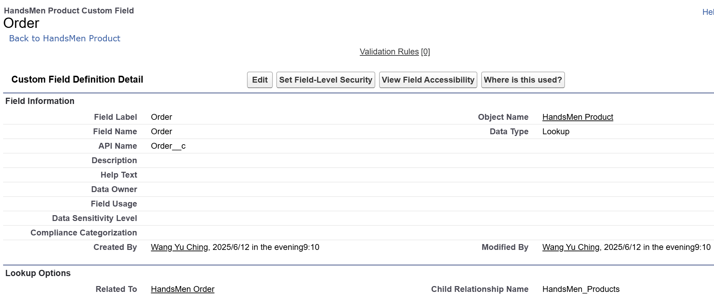
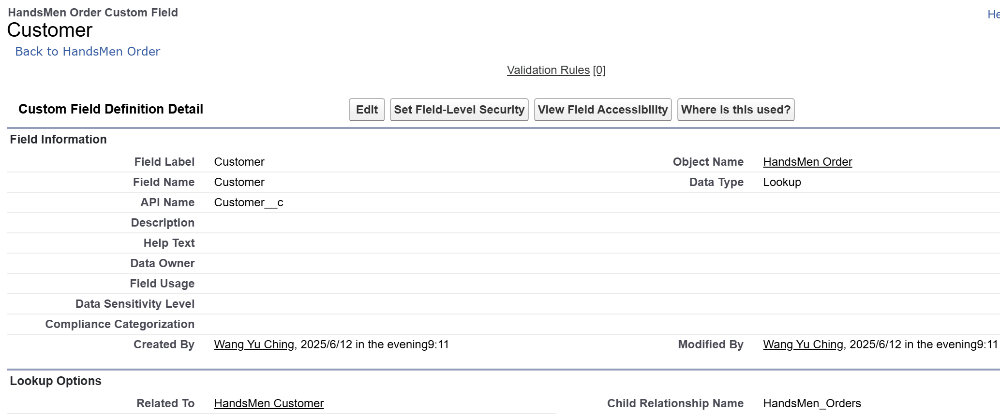
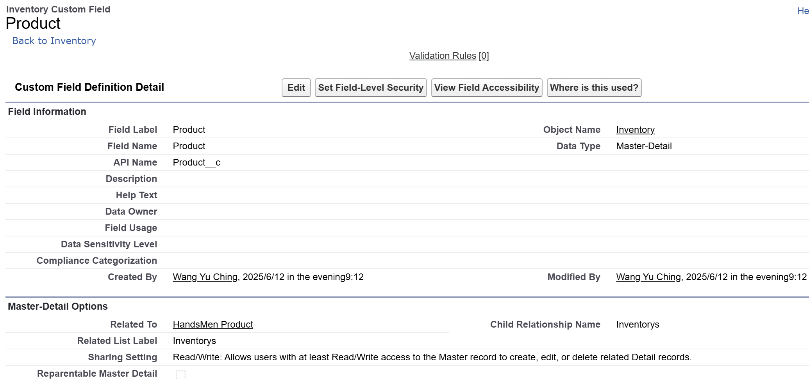

## 1️⃣Creating Field in HandsMen Customer
**Creating Field(Email) in HandsMen Customer** **Object**

*sfdx force:field:create -o HandsMen_Customer__c -l Email -n Email__c -t Email*

**Creating Phone(Phone) on HandsMen Customer Object**

*sfdx force:field:create -o HandsMen_Customer__c -l Phone -n Phone__c -t Phone*

 
**Creating Picklist field(Loyalty Status) on HandsMen Customer object**

*sfdx force:field:create ... -t Picklist -v "Gold;Silver;Bronze"*

## 2️⃣Creating Lookup Relationship
**Unit 1 : Creating Lookup Relationship between Marketing Campaign and HandsSome Customer**

sfdx force:relationship:create -o Marketing_Campaign__c -r Lookup -n HandsMen_Customer__c -l "HandsMen Customer"

**Unit 2 : Creating Lookup Relationship between HandsMen Product and HandsMen Order**

sfdx force:relationship:create -o HandsMen_Product__c -r Lookup -n HandsMen_Order__c -l "Order"

**Unit 3 : Creating Lookup Relationship between HandsMen Order and HandsMen Customer**

sfdx force:relationship:create -o HandsMen_Order__c -r Lookup -n HandsMen_Customer__c -l "Customer"

**Unit 4 : Creating Master-Detail Relationship between Inventory and HandsSome Product**

sfdx force:relationship:create -o Inventory__c -r MasterDetail -n HandsMen_Product__c -l "Product"

