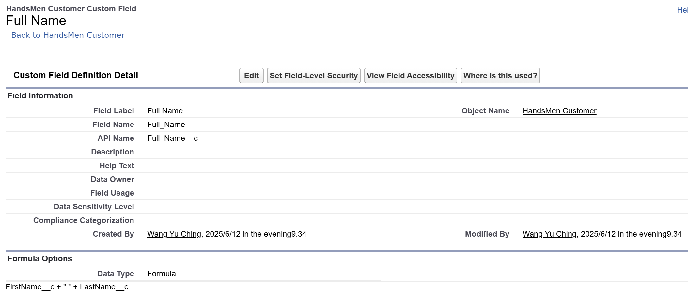
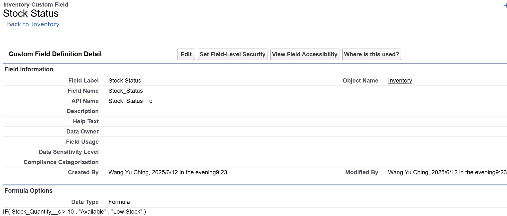
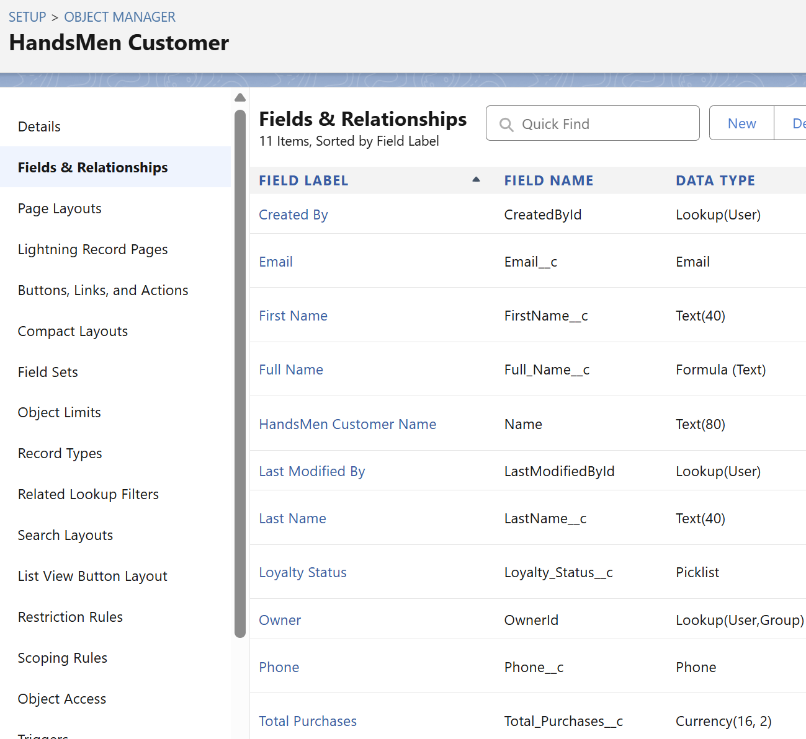
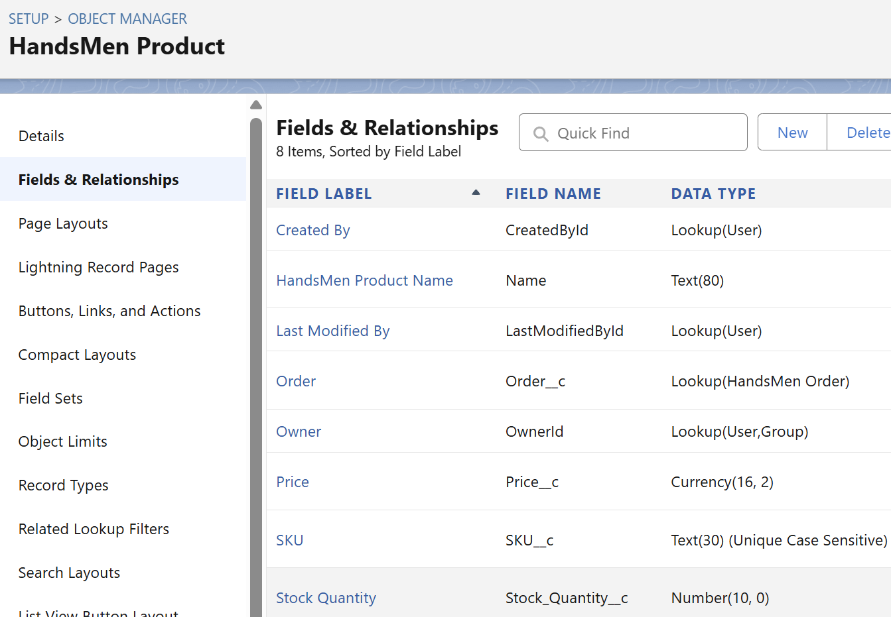
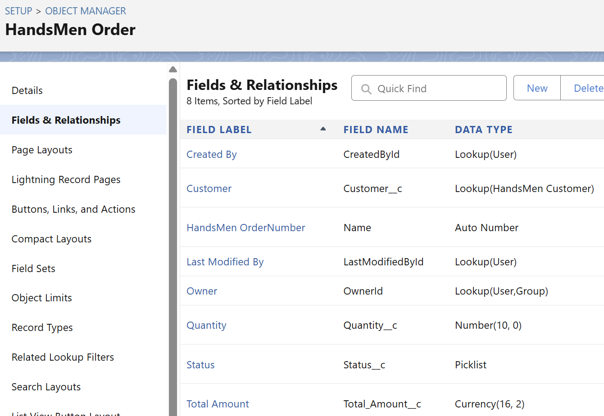
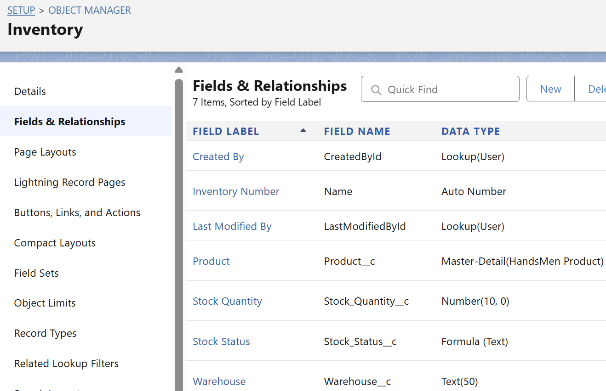
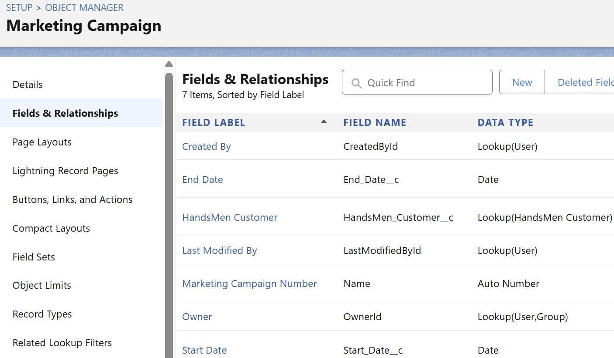

## 1️⃣Creating Field in HandsMen Customer
**Creating Field(Email) in HandsMen Customer** **Object**

*sfdx force:field:create -o HandsMen_Customer__c -l Email -n Email__c -t Email*

**Creating Phone(Phone) on HandsMen Customer Object**

*sfdx force:field:create -o HandsMen_Customer__c -l Phone -n Phone__c -t Phone*

 
**Creating Picklist field(Loyalty Status) on HandsMen Customer object**

*sfdx force:field:create ... -t Picklist -v "Gold;Silver;Bronze"*

## 2️⃣Creating Lookup Relationship
**Unit 1 : Creating Lookup Relationship between Marketing Campaign and HandsSome Customer**

sfdx force:relationship:create -o Marketing_Campaign__c -r Lookup -n HandsMen_Customer__c -l "HandsMen Customer"

**Unit 2 : Creating Lookup Relationship between HandsMen Product and HandsMen Order**

sfdx force:relationship:create -o HandsMen_Product__c -r Lookup -n HandsMen_Order__c -l "Order"

**Unit 3 : Creating Lookup Relationship between HandsMen Order and HandsMen Customer**

sfdx force:relationship:create -o HandsMen_Order__c -r Lookup -n HandsMen_Customer__c -l "Customer"

**Unit 4 : Creating Master-Detail Relationship between Inventory and HandsSome Product**

sfdx force:relationship:create -o Inventory__c -r MasterDetail -n HandsMen_Product__c -l "Product"

## 3️⃣Formula Fields
**creating the “FullName” formula field in the HandsMen Customer object**

sfdx force:field:create -o HandsMen_Customer__c -l "First Name" -n FirstName__c -t Text -l 40

sfdx force:field:create -o HandsMen_Customer__c -l "Last Name"  -n LastName__c  -t Text -l 40

sfdx force:field:create -o HandsMen_Customer__c -l "Full Name" -n Full_Name__c -t Formula -r Text -f "FirstName__c + ' ' + LastName__c"

**creating the “Stock_Status” formula field in the Inventory object**

sfdx force:field:create -o Inventory__c -l "Stock Quantity" -n Stock_Quantity__c -t Number -s 16 -p 0 -u HandsMenDev

sfdx force:field:create -o Inventory__c -l "Stock Status" -n Stock_Status__c -t Formula -r Text -f "IF(Stock_Quantity__c > 10, 'Available', 'Low Stock')"

**creating the “Stores customer details” formula field in the HandsMen Customer object**

Name (Record Name), \
Email (Email), \
Phone (Phone), \
Loyalty_Status__c (Picklist: Bronze, Gold, Silver) [Loyalty status field is already created in previous activity do not create it again,\
Total_Purchases__c (Number)

**creating the “Stores product catalog” formula field in the HandsMen Product object**

Name (Record Name), \
SKU ( Text ), \
Price (Currency),\
Stock_Quantity__c (Number)

**creating the “Stores customer orders” formula field in the HandsMen Order object**

Order_Number (Record Name), \
Status (Picklist: Pending, Confirmed, Rejection),\
Quantity__c (Number),\
Total_Amount__c(Number)

**creating the “Tracks inventory levels” formula field in the Inventory object**

Auto Number (Record Name),\
Warehouse (Text), \
Stock_Quantity__c (Number)

**creating the “Manages promotions & campaigns” formula field in the MarketingCampaign object**

Campaign_Name (Record Name), \
Start_Date (Date), \
End_Date (Date)

