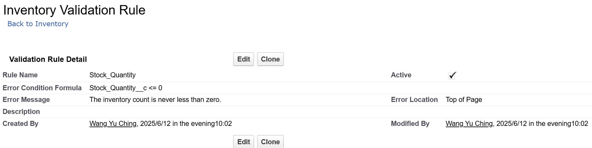

# Data Configuration
## **Activity: Creating the validation rule **

**Creating the validation rule for Postal Code field in HandsMen Order object.**

sfdx force:source:deploy -p force-app/main/default/objects/HandsMen_Order__c/validationRules/TotalAmount_Positive.validationRule-meta.xml -u HandsMenDev

**Create One more Validation rule for Inventory object.**

**Create Validation rule for HandsMen Customer object.**

