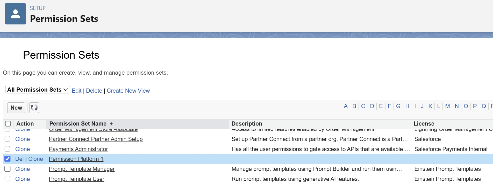
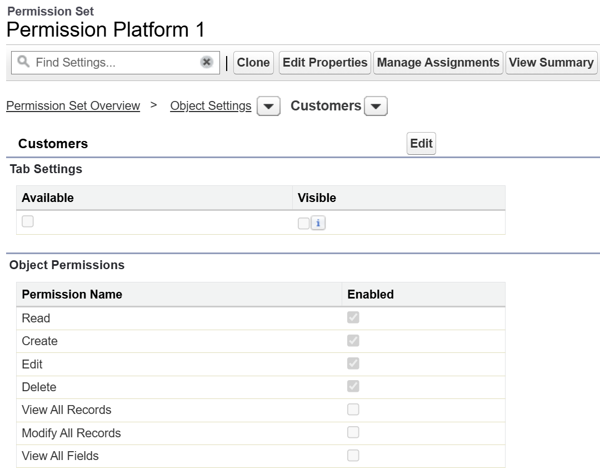
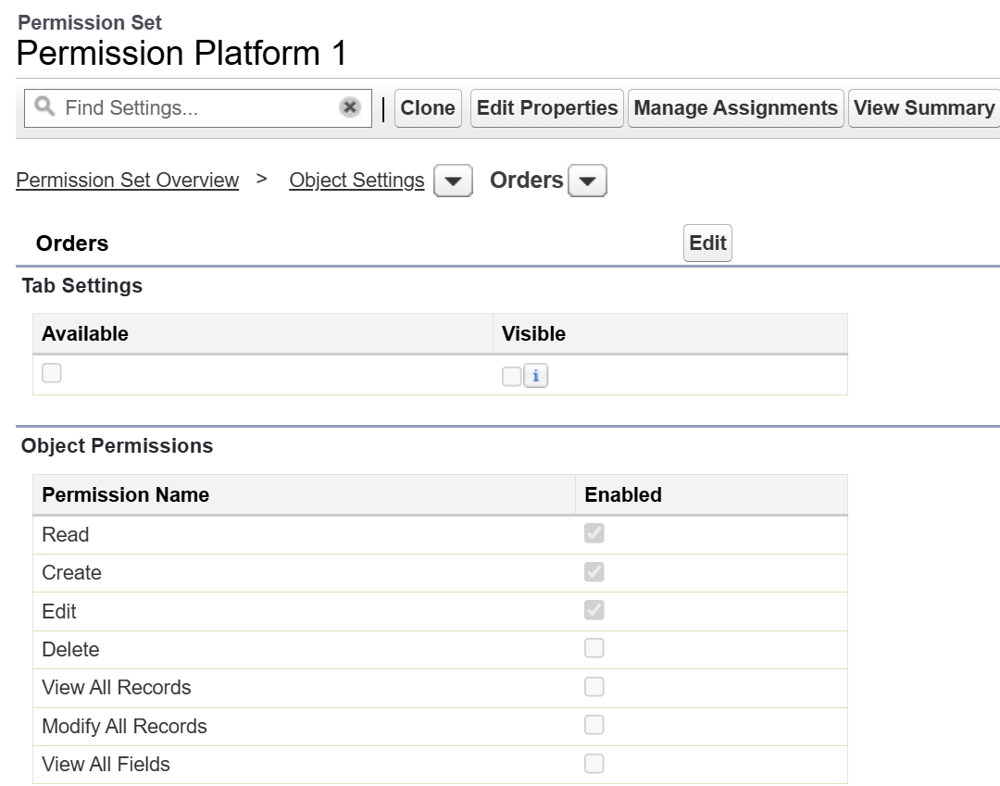
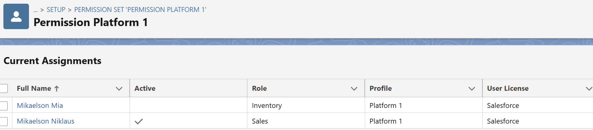

# Permission set - Permission_Platform_1

## 1) 產生 Permission_Platform_1.permissionset-meta.xml
cat > force-app/main/default/permissionsets/Permission_Platform_1.permissionset-meta.xml <<'XML'
<?xml version="1.0" encoding="UTF-8"?>
<PermissionSet xmlns="http://soap.sforce.com/2006/04/metadata">
    <label>Permission_Platform_1</label>

    <!-- HandsMen Customer -->
    <objectPermissions>
        <allowCreate>true</allowCreate>
        <allowDelete>true</allowDelete>
        <allowEdit>true</allowEdit>
        <allowRead>true</allowRead>
        <modifyAllRecords>false</modifyAllRecords>
        <object>HandsMen_Customer__c</object>
        <viewAllRecords>false</viewAllRecords>
    </objectPermissions>

    <!-- HandsMen Order -->
    <objectPermissions>
        <allowCreate>true</allowCreate>
        <allowDelete>true</allowDelete>
        <allowEdit>true</allowEdit>
        <allowRead>true</allowRead>
        <modifyAllRecords>false</modifyAllRecords>
        <object>HandsMen_Order__c</object>
        <viewAllRecords>false</viewAllRecords>
    </objectPermissions>
</PermissionSet>

XML

sfdx force:source:deploy -m "PermissionSet:Permission_Platform_1" -u <YOUR_ORG_ALIAS>

## 2) 逐一指派 Permission Set
for U in ${USER_IDS}; do
  echo "🔗  Assigning Permission_Platform_1 to user ${U}"
  sfdx force:user:permset:assign -n Permission_Platform_1 -o "${U}" -u <YOUR_ORG_ALIAS>
done

echo "完成 —— Permission_Platform_1 已部署並指派給所有 Platform 1 Profile 使用者"

