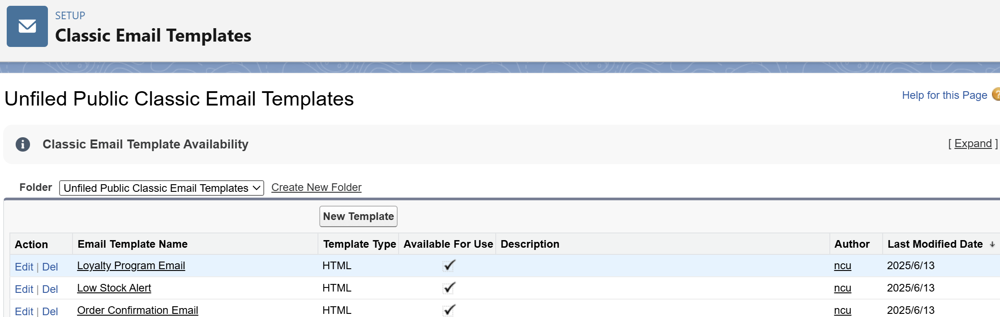
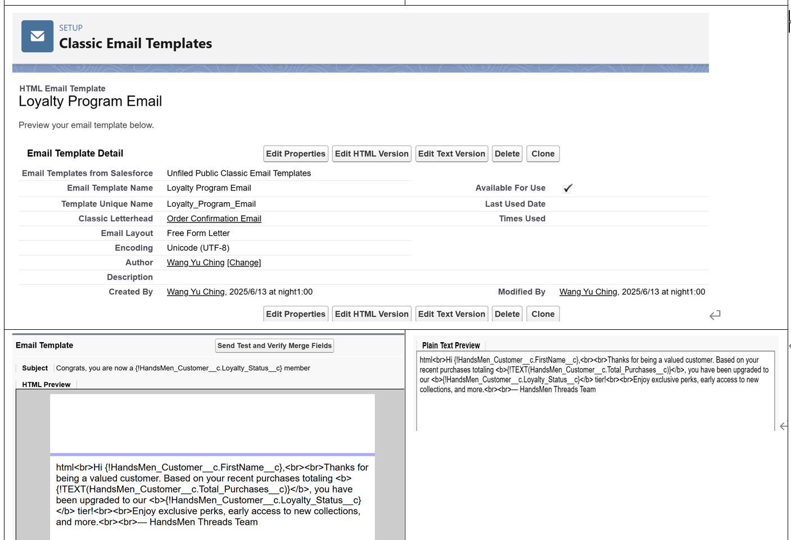
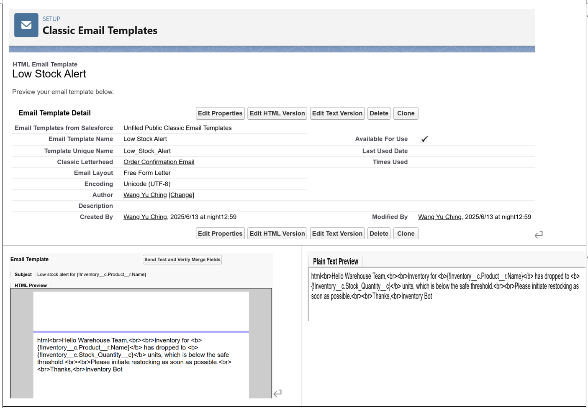

# Create an Order Confirmation Email Template
## Create a Classic Email Template

*   Choose Text, HTML (with Classic Letterhead), Custom (without Classic Letterhead), or Visualforce.
*   Select HTML (with Classic Letterhead) for a formatted email.
  

1.  Fill in Template Details

    *   Folder: Select "Unfiled Public Email Templates" (or create a new folder).
    *   Available for Use: ✅ (Check this box)
    *   Email Template Name: Order_Confirmation_Email (or appropriate name).
    *   Encoding: UTF-8 (default).
    *   Subject: Your Order has been Confirmed!

HTML Body:\
\
*
Dear {!Order__c.Customer__c},
*

*
Your order #{!Order__[c.Name](http://c.Name)} has been confirmed!
*

*
Thank you for shopping with us.
*

*
Best Regards,
*

*
Sales Team
*

## Create Remaining Email Template with the name "**Low Stock Alert**" and "**Loyalty Program Email**"

## Create an Email Alert

*   Description: Order Confirmation Email Alert
*   Object: Order__c
*   Email Template: Select the one created earlier.
*   Recipient Type: Select Related Record → Customer__c
*   Save the email alert.
