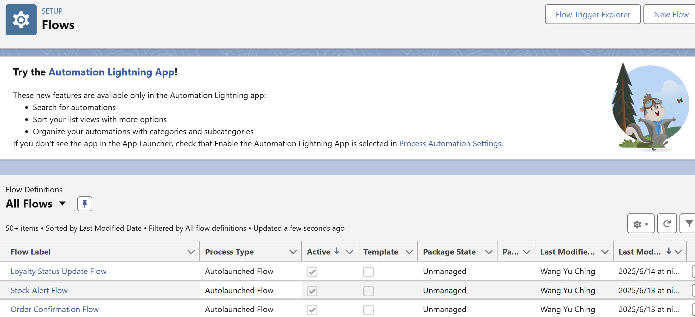
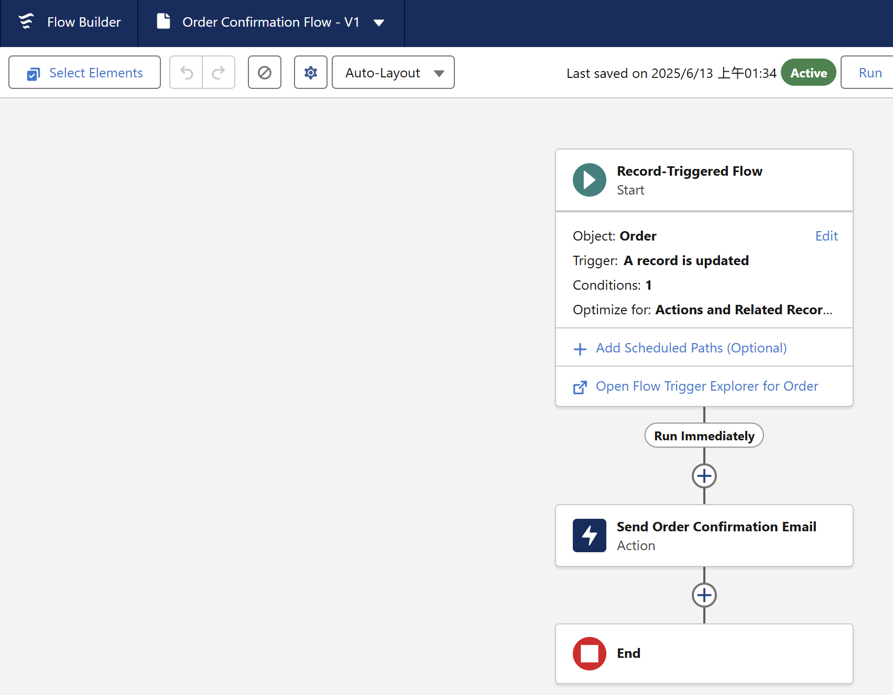
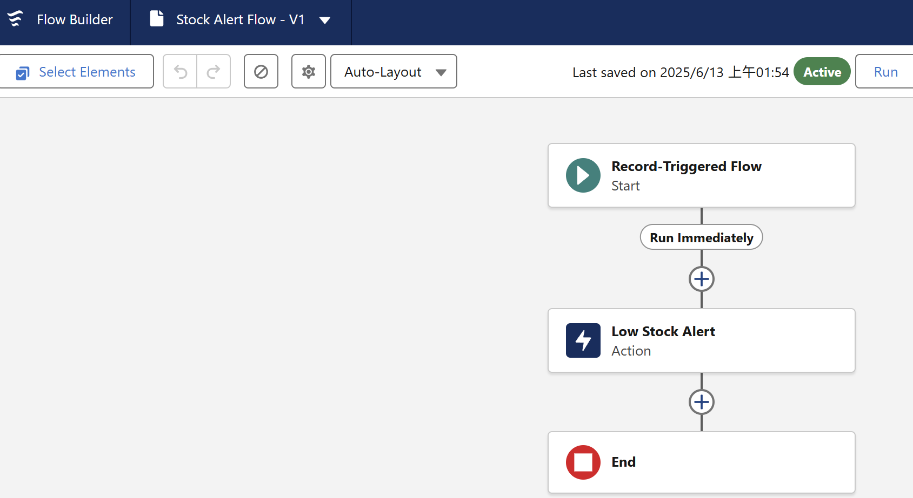

## Create Order Confirmation Email(Record-Triggered)
*   Object: Order__c
*   Trigger: When a record is updated
1.  Condition:
    *   Field: Order__c.Status__c = "Confirmed"
    *   Select Only when a record is updated to meet the condition

2.  Add an "Action" Element
    *   Click the "+" icon → Select Action.
    *   Action Type: Send Email Alert
      
*   Email Alert: Select Order Confirmation Email Alert
*   Label : Send Order Confirmation Email
*   Record ID : {!$[Record.Id]}

## Create Stock Alert Email (Record-Triggered)

*   Object: Inventory__c
*   Trigger: When a record is created or updated
1.  Condition:
        *   Field: Stock_Quantity__c < 5
        *   Select: Every time a record is updated and meets the condition requirements

2.  Add an "Action" Element
    *   Click the "+" icon → Select Action.
    *   Action Type: Send Email Alert
    *   Create a new Email Alert (Similar to the Order Confirmation setup).
    *   Recipient: Inventory Manager.

## Create Loyalty Status Update (Scheduled Flow)
