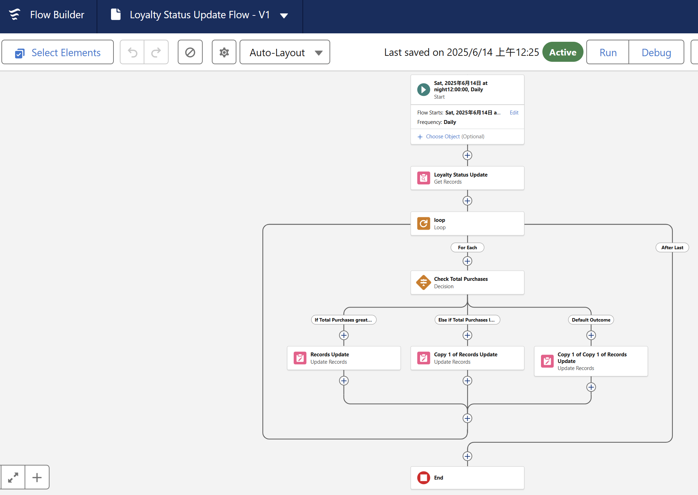

## Create Order Confirmation Email(Record-Triggered)
*   Object: Order__c
*   Trigger: When a record is updated
1.  Condition:
    *   Field: Order__c.Status__c = "Confirmed"
    *   Select Only when a record is updated to meet the condition

2.  Add an "Action" Element
    *   Click the "+" icon → Select Action.
    *   Action Type: Send Email Alert
      
*   Email Alert: Select Order Confirmation Email Alert
*   Label : Send Order Confirmation Email
*   Record ID : {!$[Record.Id]}

## Create Stock Alert Email (Record-Triggered)

*   Object: Inventory__c
*   Trigger: When a record is created or updated
1.  Condition:
        *   Field: Stock_Quantity__c < 5
        *   Select: Every time a record is updated and meets the condition requirements

2.  Add an "Action" Element
    *   Click the "+" icon → Select Action.
    *   Action Type: Send Email Alert
    *   Create a new Email Alert (Similar to the Order Confirmation setup).
    *   Recipient: Inventory Manager.

## Create Loyalty Status Update (Scheduled Flow)

1.  Set Schedule Frequency
    *   Set Start Date & Time: Choose Time to run daily.
    *   Frequency: Select Daily.

2.  Add "Get Records" Element
    *   Click the "+" icon → Select Get Records.
    *   Object: HandsMen_Customer__c
    *   Filter: Retrieve all records.
    *   Sort Order: None.

3.  Add "Loop" Element
    *   Click the "+" icon → Select Loop.
    *   Collection: {!Get_Records}
    *   Direction: First to Last.

4.  Inside Loop - 
    *   Click the "+" inside the loop → Select Decision.
    *   Set Conditions:
        *   If Total_Purchases__c > 1000, Set Loyalty_Status__c = Gold.
        *   Click the "+" Add Update Records
        *   Records to Update: Select Specify Condition 
        *   Object: HandsMen Customer
        *   Set Field Values: Loyalty_Status__c = Gold

*   Else if Total_Purchases__c < 500, 
Set Loyalty_Status__c = Bronze.
*   Else,  (Default Outcome) Set Loyalty_Status__c =Silver.

