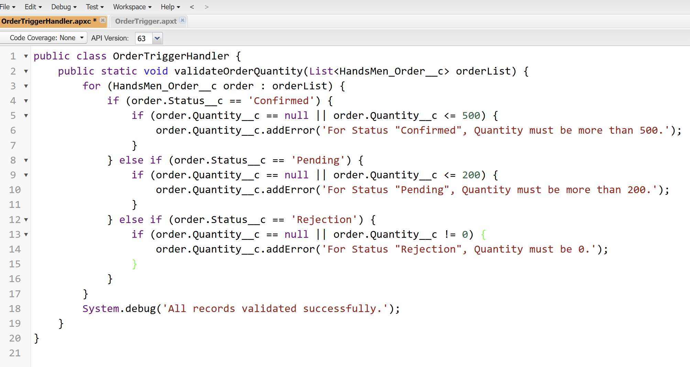

## Create an Apex Class

**Source Code:**

```public class OrderTriggerHandler {
    public static void validateOrderQuantity(List<HandsMen_Order__c> orderList) {
        for (HandsMen_Order__c order : orderList) {
            if (order.Status__c == 'Confirmed') {
                if (order.Quantity__c == null || order.Quantity__c <= 500) {
                    order.Quantity__c.addError('For Status "Confirmed", Quantity must be more than 500.');
                }
            } else if (order.Status__c == 'Pending') {
                if (order.Quantity__c == null || order.Quantity__c <= 200) {
                    order.Quantity__c.addError('For Status "Pending", Quantity must be more than 200.');
                }
            } else if (order.Status__c == 'Rejection') {
                if (order.Quantity__c == null || order.Quantity__c != 0) {
                    order.Quantity__c.addError('For Status "Rejection", Quantity must be 0.');
                }
            }
        }
        System.debug('All records validated successfully.');
    }
}
```



## Create an Apex Trigger

**Source Code:**

```trigger OrderTrigger on HandsMen_Order__c (before insert, before update) {
    if (Trigger.isBefore && (Trigger.isInsert || Trigger.isUpdate)) {
        OrderTriggerHandler.validateOrderQuantity([Trigger.new]);
    }
}
```


