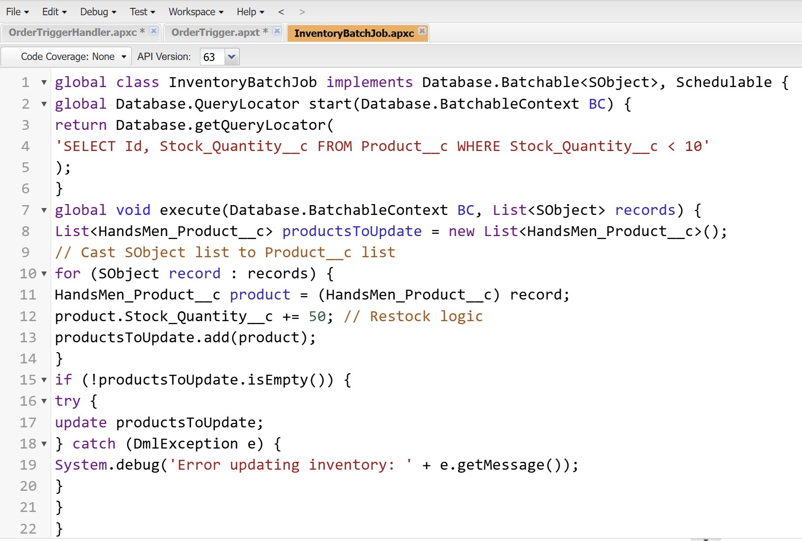
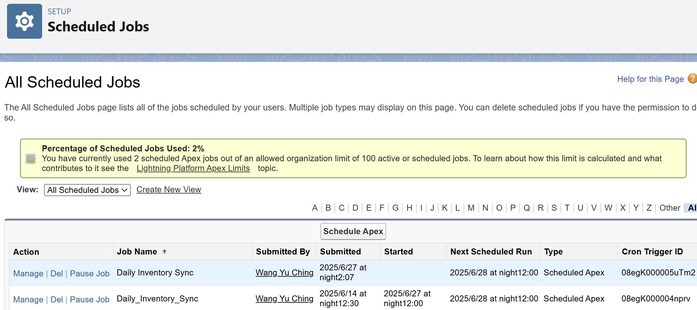

## Create an Apex Class

**Source Code:**

```global class InventoryBatchJob implements Database.Batchable<SObject>, Schedulable {
global Database.QueryLocator start(Database.BatchableContext BC) {
return Database.getQueryLocator(
'SELECT Id, Stock_Quantity__c FROM Product__c WHERE Stock_Quantity__c < 10'
);
}
global void execute(Database.BatchableContext BC, List<SObject> records) {
List<HandsMen_Product__c> productsToUpdate = new List<HandsMen_Product__c>();

// Cast SObject list to Product__c list
for (SObject record : records) {
HandsMen_Product__c product = (HandsMen_Product__c) record;
product.Stock_Quantity__c += 50; // Restock logic
productsToUpdate.add(product);
}

if (!productsToUpdate.isEmpty()) {
try {
update productsToUpdate;
} catch (DmlException e) {
System.debug('Error updating inventory: ' + e.getMessage());
}
}
}

global void finish(Database.BatchableContext BC) {
System.debug('Inventory Sync Completed');
}

// Scheduler Method
global void execute(SchedulableContext SC) {
InventoryBatchJob batchJob = new InventoryBatchJob();
Database.executeBatch(batchJob, 200);
}
}
```



**Activity 2 :**


* Open Execute Anonymous Window

  Source Code :
```
System.schedule(‘Daily Inventory Sync’ , ‘0 0 0 * * ?’ , new InventoryBatchJob());
```


**Schedule the Apex class**

Click on “Schedule Jobs” as shown below


